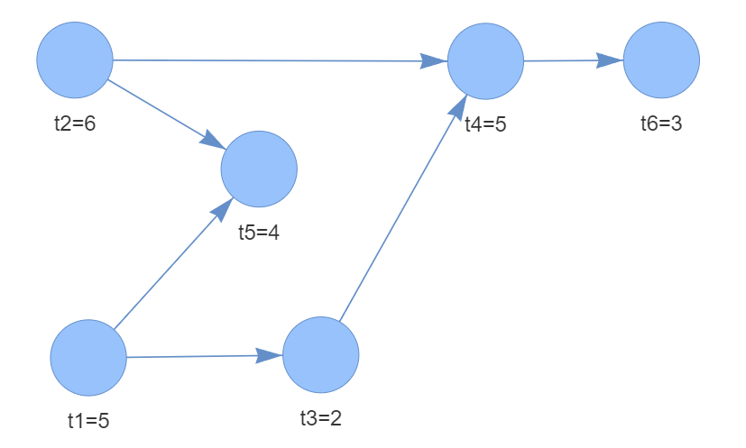

# Задача балансування збриальної лінії (SALBP-1)



## Приклад вирішення:
Завантаження умови задачі:
```python
from salbpone import SolverSALBP, LatexConverter

# Масив з тривалістю операцій
t = [5, 6, 2, 5, 4, 3]

# Словник з залежностями операцій
procedure_graph = {
    1: [],
    2: [],
    3: [1],
    4: [2, 3],
    5: [1, 2],
    6: [4]
}

# Час циклу Т
cycle_time = 10

s = SolverSALBP(operations_costs=t,
                cycle_time=cycle_time,
                precedence_graph=procedure_graph,
                verbose=True)
```

Підготовка обмежень:
```commandline
07.07.2024 02:02:00 | INFO | Створення екземпляру вирішення SALBP-1...
07.07.2024 02:02:00 | INFO | Перевірка умови задачі...
07.07.2024 02:02:00 | DEBUG | Тривалість циклу (Т): 10
07.07.2024 02:02:00 | DEBUG | Тривалості операцій (t_i): t1 = 5, t2 = 6, t3 = 2, t4 = 5, t5 = 4, t6 = 3
07.07.2024 02:02:00 | DEBUG | До початку операції t1 обмежень немає
07.07.2024 02:02:00 | DEBUG | До початку операції t2 обмежень немає
07.07.2024 02:02:00 | DEBUG | До початку операції t3 мають бути виконані операції: t1
07.07.2024 02:02:00 | DEBUG | До початку операції t4 мають бути виконані операції: t2, t3
07.07.2024 02:02:00 | DEBUG | До початку операції t5 мають бути виконані операції: t1, t2
07.07.2024 02:02:00 | DEBUG | До початку операції t6 мають бути виконані операції: t4
07.07.2024 02:02:00 | SUCCESS | Отримано та перевірено умову задачі (n=6, T=10)
07.07.2024 02:02:00 | INFO | Розширення умови допоміжними змінними...
07.07.2024 02:02:00 | DEBUG | Мінімальна (теоретична) кількість робочих станції (m_min): 3
07.07.2024 02:02:00 | DEBUG | Максимальна (найгірший випадок) кількість робочих станції (m_max): 6
07.07.2024 02:02:00 | DEBUG | Тільки після t1 можуть розпочатись (ST): t3, t4, t5, t6
07.07.2024 02:02:00 | DEBUG | Тільки після t2 можуть розпочатись (ST): t4, t5, t6
07.07.2024 02:02:00 | DEBUG | Тільки після t3 можуть розпочатись (ST): t4, t6
07.07.2024 02:02:00 | DEBUG | Тільки після t4 можуть розпочатись (ST): t6
07.07.2024 02:02:00 | DEBUG | Перед t3 мають завершитись (PT): t1
07.07.2024 02:02:00 | DEBUG | Перед t4 мають завершитись (PT): t1, t2, t3
07.07.2024 02:02:00 | DEBUG | Перед t5 мають завершитись (PT): t1, t2
07.07.2024 02:02:00 | DEBUG | Перед t6 мають завершитись (PT): t1, t2, t3, t4
07.07.2024 02:02:00 | DEBUG | Операція t1 не може бути за межами станцій [E1,L1] = [1...5]
07.07.2024 02:02:00 | DEBUG | Операція t2 не може бути за межами станцій [E2,L2] = [1...5]
07.07.2024 02:02:00 | DEBUG | Операція t3 не може бути за межами станцій [E3,L3] = [1...6]
07.07.2024 02:02:00 | DEBUG | Операція t4 не може бути за межами станцій [E4,L4] = [2...6]
07.07.2024 02:02:00 | DEBUG | Операція t5 не може бути за межами станцій [E5,L5] = [2...6]
07.07.2024 02:02:00 | DEBUG | Операція t6 не може бути за межами станцій [E6,L6] = [3...6]
07.07.2024 02:02:00 | DEBUG | Додана залежність P_ik: перед t3 має бути виконана t1
07.07.2024 02:02:00 | DEBUG | Додана залежність P_ik: перед t4 має бути виконана t2
07.07.2024 02:02:00 | DEBUG | Додана залежність P_ik: перед t4 має бути виконана t3
07.07.2024 02:02:00 | DEBUG | Додана залежність P_ik: перед t5 має бути виконана t1
07.07.2024 02:02:00 | DEBUG | Додана залежність P_ik: перед t5 має бути виконана t2
07.07.2024 02:02:00 | DEBUG | Додана залежність P_ik: перед t6 має бути виконана t4
07.07.2024 02:02:00 | SUCCESS | Створено допоміжні змінні (m, L, E, P, PT, ST)
07.07.2024 02:02:00 | INFO | Цільова функція: min 4 * y[4] + 5 * y[5] + 6 * y[6]
07.07.2024 02:02:00 | INFO | Формування обмежень...
07.07.2024 02:02:00 | INFO | Обмеження призначення операції одному й тільки одному робочому місцю...
07.07.2024 02:02:00 | DEBUG | x[1][1] + x[1][2] + x[1][3] + x[1][4] + x[1][5] == 1
07.07.2024 02:02:00 | DEBUG | x[2][1] + x[2][2] + x[2][3] + x[2][4] + x[2][5] == 1
07.07.2024 02:02:00 | DEBUG | x[3][1] + x[3][2] + x[3][3] + x[3][4] + x[3][5] + x[3][6] == 1
07.07.2024 02:02:00 | DEBUG | x[4][2] + x[4][3] + x[4][4] + x[4][5] + x[4][6] == 1
07.07.2024 02:02:00 | DEBUG | x[5][2] + x[5][3] + x[5][4] + x[5][5] + x[5][6] == 1
07.07.2024 02:02:00 | DEBUG | x[6][3] + x[6][4] + x[6][5] + x[6][6] == 1
07.07.2024 02:02:00 | DEBUG | Додано обмежень 6
07.07.2024 02:02:00 | INFO | Дотримання часу виробничого циклу...
07.07.2024 02:02:00 | DEBUG | 5 * x[1][1] + 6 * x[2][1] + 2 * x[3][1] <= 10
07.07.2024 02:02:00 | DEBUG | 5 * x[1][2] + 6 * x[2][2] + 2 * x[3][2] + 5 * x[4][2] + 4 * x[5][2] <= 10
07.07.2024 02:02:00 | DEBUG | 5 * x[1][3] + 6 * x[2][3] + 2 * x[3][3] + 5 * x[4][3] + 4 * x[5][3] + 3 * x[6][3] <= 10
07.07.2024 02:02:00 | DEBUG | 5 * x[1][4] + 6 * x[2][4] + 2 * x[3][4] + 5 * x[4][4] + 4 * x[5][4] + 3 * x[6][4] <= 10 * y[4]
07.07.2024 02:02:00 | DEBUG | 5 * x[1][5] + 6 * x[2][5] + 2 * x[3][5] + 5 * x[4][5] + 4 * x[5][5] + 3 * x[6][5] <= 10 * y[5]
07.07.2024 02:02:00 | DEBUG | 2 * x[3][6] + 5 * x[4][6] + 4 * x[5][6] + 3 * x[6][6] <= 10 * y[6]
07.07.2024 02:02:00 | DEBUG | Додано обмежень 6
07.07.2024 02:02:00 | INFO | Дотримання послідовності виробництва...
07.07.2024 02:02:00 | DEBUG | 1 * x[2][1] + 2 * x[2][2] + 3 * x[2][3] + 4 * x[2][4] + 5 * x[2][5] <= 2 * x[4][2] + 3 * x[4][3] + 4 * x[4][4] + 5 * x[4][5] + 6 * x[4][6]
07.07.2024 02:02:00 | DEBUG | 1 * x[3][1] + 2 * x[3][2] + 3 * x[3][3] + 4 * x[3][4] + 5 * x[3][5] + 6 * x[3][6] <= 2 * x[4][2] + 3 * x[4][3] + 4 * x[4][4] + 5 * x[4][5] + 6 * x[4][6]
07.07.2024 02:02:00 | DEBUG | 1 * x[1][1] + 2 * x[1][2] + 3 * x[1][3] + 4 * x[1][4] + 5 * x[1][5] <= 2 * x[5][2] + 3 * x[5][3] + 4 * x[5][4] + 5 * x[5][5] + 6 * x[5][6]
07.07.2024 02:02:00 | DEBUG | 2 * x[4][2] + 3 * x[4][3] + 4 * x[4][4] + 5 * x[4][5] + 6 * x[4][6] <= 3 * x[6][3] + 4 * x[6][4] + 5 * x[6][5] + 6 * x[6][6]
07.07.2024 02:02:00 | DEBUG | 1 * x[2][1] + 2 * x[2][2] + 3 * x[2][3] + 4 * x[2][4] + 5 * x[2][5] <= 2 * x[5][2] + 3 * x[5][3] + 4 * x[5][4] + 5 * x[5][5] + 6 * x[5][6]
07.07.2024 02:02:00 | DEBUG | 1 * x[1][1] + 2 * x[1][2] + 3 * x[1][3] + 4 * x[1][4] + 5 * x[1][5] <= 1 * x[3][1] + 2 * x[3][2] + 3 * x[3][3] + 4 * x[3][4] + 5 * x[3][5] + 6 * x[3][6]
07.07.2024 02:02:00 | DEBUG | Додано обмежень 6
07.07.2024 02:02:00 | INFO | Обмеження увімкнення тільки задіяних станцій...
07.07.2024 02:02:00 | DEBUG | x[1][5] <= y[6]
07.07.2024 02:02:00 | DEBUG | x[1][4] <= y[5]
07.07.2024 02:02:00 | DEBUG | x[1][3] <= y[4]
07.07.2024 02:02:00 | DEBUG | x[2][5] <= y[6]
07.07.2024 02:02:00 | DEBUG | x[2][4] <= y[5]
07.07.2024 02:02:00 | DEBUG | x[2][3] <= y[4]
07.07.2024 02:02:00 | DEBUG | x[3][6] <= y[6]
07.07.2024 02:02:00 | DEBUG | x[3][5] <= y[5]
07.07.2024 02:02:00 | DEBUG | x[3][4] <= y[4]
07.07.2024 02:02:00 | DEBUG | x[3][3] <= y[3]
07.07.2024 02:02:00 | DEBUG | x[4][6] <= y[6]
07.07.2024 02:02:00 | DEBUG | x[4][5] <= y[5]
07.07.2024 02:02:00 | DEBUG | x[4][4] <= y[4]
07.07.2024 02:02:00 | DEBUG | x[4][3] <= y[3]
07.07.2024 02:02:00 | DEBUG | x[5][6] <= y[6]
07.07.2024 02:02:00 | DEBUG | x[5][5] <= y[5]
07.07.2024 02:02:00 | DEBUG | x[5][4] <= y[4]
07.07.2024 02:02:00 | DEBUG | x[5][3] <= y[3]
07.07.2024 02:02:00 | DEBUG | x[6][6] <= y[6]
07.07.2024 02:02:00 | DEBUG | x[6][5] <= y[5]
07.07.2024 02:02:00 | DEBUG | x[6][4] <= y[4]
07.07.2024 02:02:00 | DEBUG | x[6][3] <= y[3]
07.07.2024 02:02:00 | DEBUG | Додано обмежень 22
07.07.2024 02:02:00 | INFO | Вирішення задачі...
```

Результат:
```commandline
07.07.2024 02:02:00 | SUCCESS | Знайдено оптимальне рішення

07.07.2024 02:02:00 | SUCCESS | Матриця призначення:
07.07.2024 02:02:00 | SUCCESS | t1: |   | + |   |   |   |  
07.07.2024 02:02:00 | SUCCESS | t2: | + |   |   |   |   |  
07.07.2024 02:02:00 | SUCCESS | t3: |   |   | + |   |   |  
07.07.2024 02:02:00 | SUCCESS | t4: |   |   | + |   |   |  
07.07.2024 02:02:00 | SUCCESS | t5: |   | + |   |   |   |  
07.07.2024 02:02:00 | SUCCESS | t6: |   |   | + |   |   |  

07.07.2024 02:02:00 | SUCCESS | Завантаження станцій:
07.07.2024 02:02:00 | SUCCESS | Станція J1: 6
07.07.2024 02:02:00 | SUCCESS | Станція J2: 9
07.07.2024 02:02:00 | SUCCESS | Станція J3: 10
07.07.2024 02:02:00 | SUCCESS | Станція J4: 0
07.07.2024 02:02:00 | SUCCESS | Станція J5: 0
07.07.2024 02:02:00 | SUCCESS | Станція J6: 0

07.07.2024 02:02:00 | SUCCESS | Увімкнені станції: 3
```

## Конвертування знайдених обмежень Latex

```python
lat = LatexConverter(constraints=s.constraints)
lat.print_latex()
```

```commandline
x_{1,1} + x_{1,2} + x_{1,3} + x_{1,4} + x_{1,5} == 1
x_{2,1} + x_{2,2} + x_{2,3} + x_{2,4} + x_{2,5} == 1
x_{3,1} + x_{3,2} + x_{3,3} + x_{3,4} + x_{3,5} + x_{3,6} == 1
x_{4,2} + x_{4,3} + x_{4,4} + x_{4,5} + x_{4,6} == 1
x_{5,2} + x_{5,3} + x_{5,4} + x_{5,5} + x_{5,6} == 1
x_{6,3} + x_{6,4} + x_{6,5} + x_{6,6} == 1
5 \cdot x_{1,1} + 6 \cdot x_{2,1} + 2 \cdot x_{3,1} \leq 10
5 \cdot x_{1,2} + 6 \cdot x_{2,2} + 2 \cdot x_{3,2} + 5 \cdot x_{4,2} + 4 \cdot x_{5,2} \leq 10
5 \cdot x_{1,3} + 6 \cdot x_{2,3} + 2 \cdot x_{3,3} + 5 \cdot x_{4,3} + 4 \cdot x_{5,3} + 3 \cdot x_{6,3} \leq 10
5 \cdot x_{1,4} + 6 \cdot x_{2,4} + 2 \cdot x_{3,4} + 5 \cdot x_{4,4} + 4 \cdot x_{5,4} + 3 \cdot x_{6,4} \leq 10 \cdot y_{4}
5 \cdot x_{1,5} + 6 \cdot x_{2,5} + 2 \cdot x_{3,5} + 5 \cdot x_{4,5} + 4 \cdot x_{5,5} + 3 \cdot x_{6,5} \leq 10 \cdot y_{5}
...
```